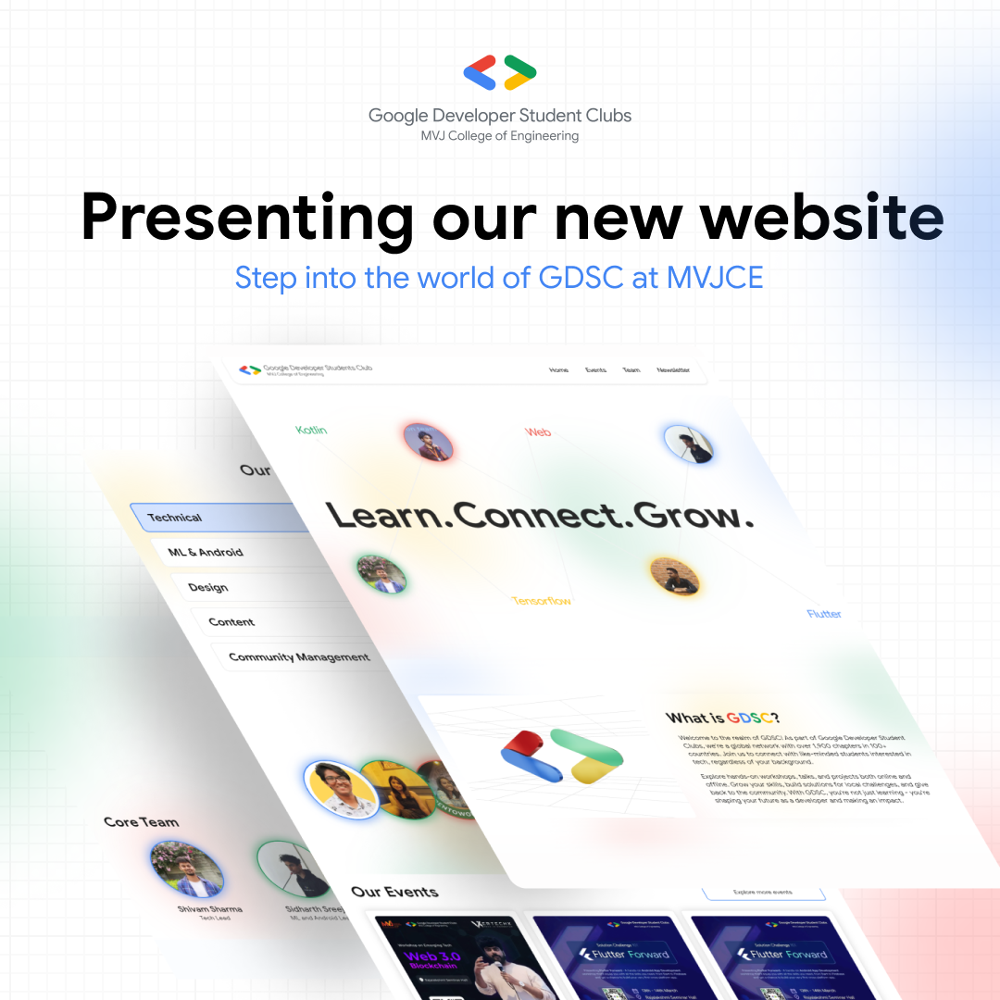
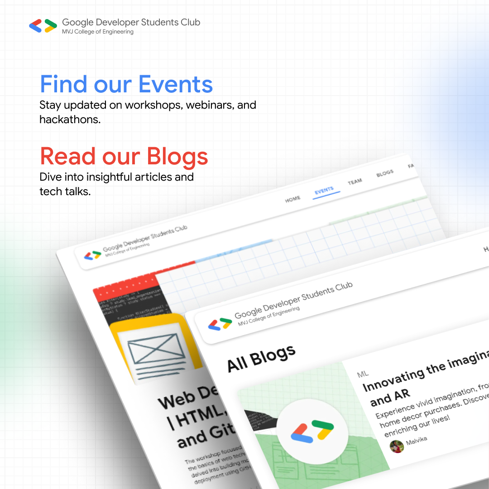
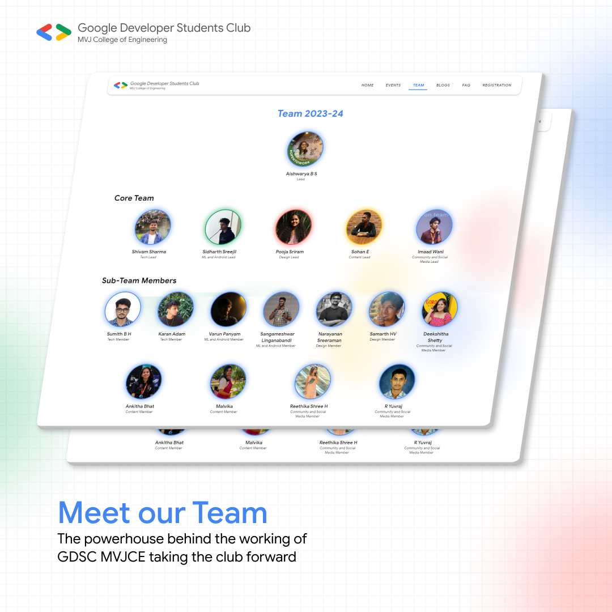
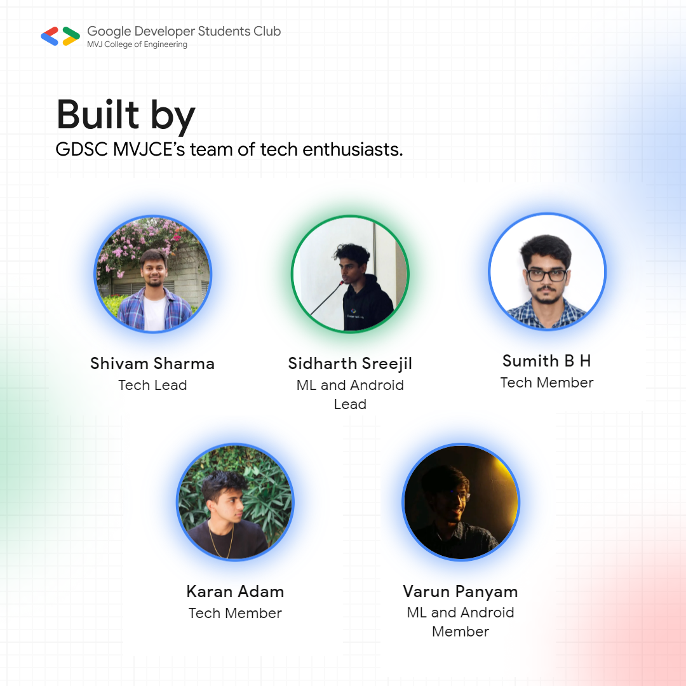

# GDSC MVJCE Website

The GDSC MVJCE Website is a dynamic platform developed using Next.js 13, styled-components, react-three-fiber, prisma and various other packages. It serves as the central hub for the Google Developer Student Club community at MVJ College of Engineering, providing interactive sections, event registration, blog showcases, team information, and FAQs.

It is a comprehensive platform designed to facilitate engagement and collaboration within the Google Developer Student Club community at MVJ College of Engineering. Whether you're exploring past events, registering for upcoming events, reading insightful blogs, or learning about the GDSC team, you'll find everything you need right here.

## Table of Contents

- [Screenshots](#screenshots)
- [Demo](#demo)
- [Features](#features)
- [Technologies Used](#technologies-used)
- [Packages Used](#packages-used)
- [Environment Variables](#environment-variables)
- [Getting Started](#getting-started)
- [Folder Structure](#folder-structure)
- [Running the Application](#running-the-application)
- [Authors](#authors)
- [Contributing](#contributing)
- [License](#license)
- [Documentation](#documentation)

## Screenshots







## Demo

You can explore a live demo of the GDSC MVJCE Website at [Demo Link](https://gdscmvjce.tech).

## Features

- Interactive landing page with various sections
- Showcase of past events with detailed information
- Registration for upcoming events
- Display of blogs written by GDSC members
- View the present and past GDSC teams for each batch
- FAQ page covering various topics such as general queries, registration, application process, community involvement, and newsletters

## Technologies Used

- Next.js 13
- Styled-components
- React-three-fiber
- Prisma

## Packages Used

Here are the main packages used in the project:

- `@dnd-kit/core`: Drag and drop utilities for React applications.
- `@dnd-kit/modifiers`: Modifiers for Drag and Drop interactions.
- `@emotion/react`: Library for CSS-in-JS styling with Emotion.
- `@emotion/styled`: Styled components for Emotion.
- `@mui/icons-material`: Material-UI icons for UI design.
- `@mui/material`: Material-UI components for modern web applications.
- `@fullcalendar/react`: React wrapper for FullCalendar.
- `dayjs`: Library for date and time formatting.
- `http-status-codes`: Library for HTTP status codes.
- `lottie-react`: Library for rendering Lottie animations in React.
- `next`: Framework for server-rendered React applications.
- `nextjs-toploader`: Top loader for Next.js applications.
- `prisma`: ORM for database management.
- `ra-data-simple-prisma`: Data provider for React Admin using Prisma.
- `ra-data-simple-rest`: Simple REST data provider for React Admin.
- `ra-input-rich-text`: Rich text input for React Admin.
- `react`: JavaScript library for building user interfaces.
- `react-dom`: React library for DOM rendering.
- `react-infinite-scroll-component`: Infinite scroll component for React.
- `react-intersection-observer`: Library for observing elements entering or exiting the viewport.
- `react-parallax-tilt`: Parallax tilt effect component for React.
- `react-scroll-motion`: Scroll motion library for React.
- `react-spring-3d-carousel`: 3D carousel component for React Spring.
- `react-vertical-timeline-component`: Vertical timeline component for React.
- `react-xarrows`: React component for drawing customizable arrows.

## Environment Variables

The project relies on environment variables stored in a .env. file located at the root of the directory to manage configurations. Ensure that essential variables such as database connection strings, API keys, or any other sensitive information are properly set up.

```bash
DATABASE_URL: "*YOUR-DB-URL*"
NEXT_PUBLIC_APIKEY: "*YOUR-NEXT-PUBLIC-KEY*".
```

Be sure to replace `*YOUR-DB-URL*` with your actual MySQL database url containing data and `*YOUR-NEXT-PUBLIC-KEY*` with your Next.js public API key. These values should be obtained from the respective services and kept confidential.

**Note**: Environment variables containing sensitive information like API keys, database credentials, or any other secrets should not be committed to version control. Ensure that the `.env` files are included in your project's `.gitignore` file to prevent accidental exposure of sensitive data.

## Getting Started

Follow these steps to set up the project locally:

1. Clone this repository to your local machine:

```bash
git clone https://github.com/GDSC-MVJCE/gdscmvjce-website.git
```

2. Change to the project directory:

```bash
cd gdscmvjce-website
```

3. Install dependencies and start the development server:

```bash
npm install
npx prisma generate
npx prisma db push
npm run dev
```

## Folder Structure

The project structure is organized as follows:

```
gdscmvjce-website/
├── components/        # Contains reusable React components used throughout the application.
├── constants/         # Contains constants or configurations used in the application.
├── controllers/       # Contains route controllers for handling HTTP requests.
├── hooks/             # Contains custom React hooks for reusing logic across components.
├── lib/               # Contains utility functions or libraries used in the application.
├── pages/             # Contains different pages for the website.
├── prisma/            # Contains Prisma database models.
├── public/            # Contains public assets such as images, fonts, etc.
├── utils/             # Contains utility functions used across the application.
├── .env               # Environment variables file (not committed to version control).
├── next.config.js     # Next.js configuration file.
├── package.json       # Contains project metadata and dependencies.
└── README.md          # Readme file providing information about the project.
```

## Running the Application

To run the application locally, use the following commands:

```bash
npm install       # Install dependencies
npm run dev       # Start the development server
```

In another terminal window, run the following command to start the Prisma server:

```bash
npx prisma generate
npx prisma db push
```

## Authors

- [@Shivam-Sharma-1](https://github.com/Shivam-Sharma-1)
- [@sid-js](https://github.com/sid-js)
- [@Vector-ops](https://github.com/Vector-ops)
- [@notBigO](https://github.com/notBigO)
- [@karanadam](https://github.com/karanadam)

## Contributing

We welcome contributions from the community! If you have ideas for new features, improvements, or bug fixes, feel free to open an issue or submit a pull request.

## License

This project is licensed under the [MIT License](LICENSE).

Thank you for visiting the GDSC MVJCE Website repository! We hope you find the content here inspiring and engaging. If you have any questions or feedback, don't hesitate to reach out. Happy coding! 🚀

## Documentation

- **[React Documentation](https://reactjs.org/docs/getting-started.html)**: Learn more about React for building user interfaces.
- **[Next.js Documentation](https://nextjs.org/docs/getting-started)**: Discover Next.js documentation for React framework.
- **[React Three Fiber Documentation](https://docs.pmnd.rs/react-three-fiber/getting-started/introduction)**: Dive into React Three Fiber documentation for creating 3D graphics in React.
- **[Styled-Components Documentation](https://styled-components.com/docs)**: Learn about Styled-Components for styling React components.
- **[Day.js Documentation](https://day.js.org/docs/en/installation/installation)**: Explore Day.js documentation for lightweight date and time library.
- **[Lottie React Documentation](https://www.npmjs.com/package/lottie-react)**: Discover Lottie React documentation for using Lottie animations in React.
- **[React Admin Documentation](https://marmelab.com/react-admin/Readme.html)**: Learn about React Admin for building administration user interfaces.
- **[SWR Documentation](https://swr.vercel.app/docs/getting-started)**: Explore SWR documentation for data fetching library for React.
- **[React Infinite Scroll Component Documentation](https://www.npmjs.com/package/react-infinite-scroll-component)**: Discover React Infinite Scroll Component documentation for creating infinite scroll in React.
- **[React Intersection Observer Documentation](https://www.npmjs.com/package/react-intersection-observer)**: Learn about React Intersection Observer for detecting elements' visibility in the viewport.
- **[Prisma Documentation](https://www.prisma.io/docs/)**: Dive into Prisma documentation for ORM and database management.

**GDSC MVJCE Team**
**Connect. Learn. Grow.**
